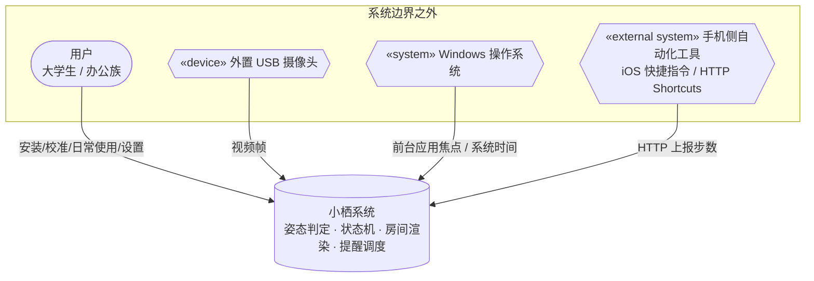
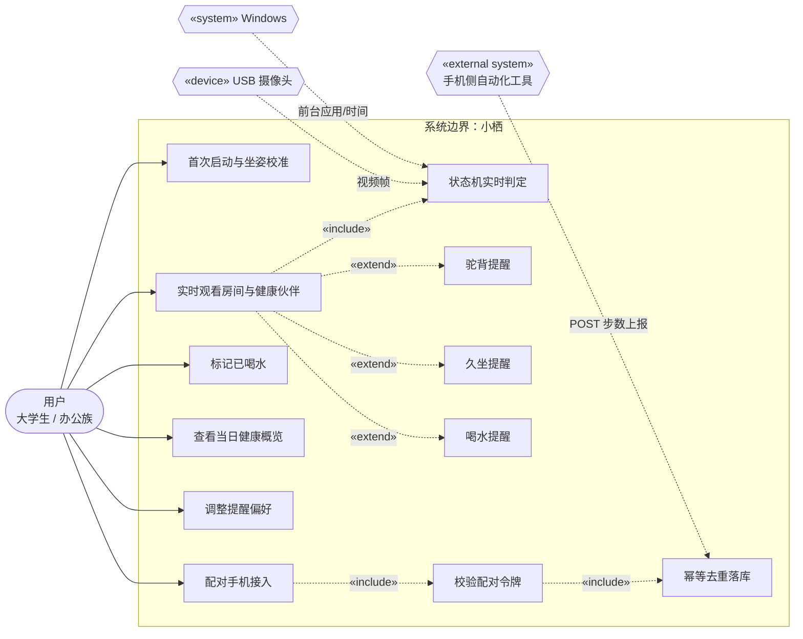
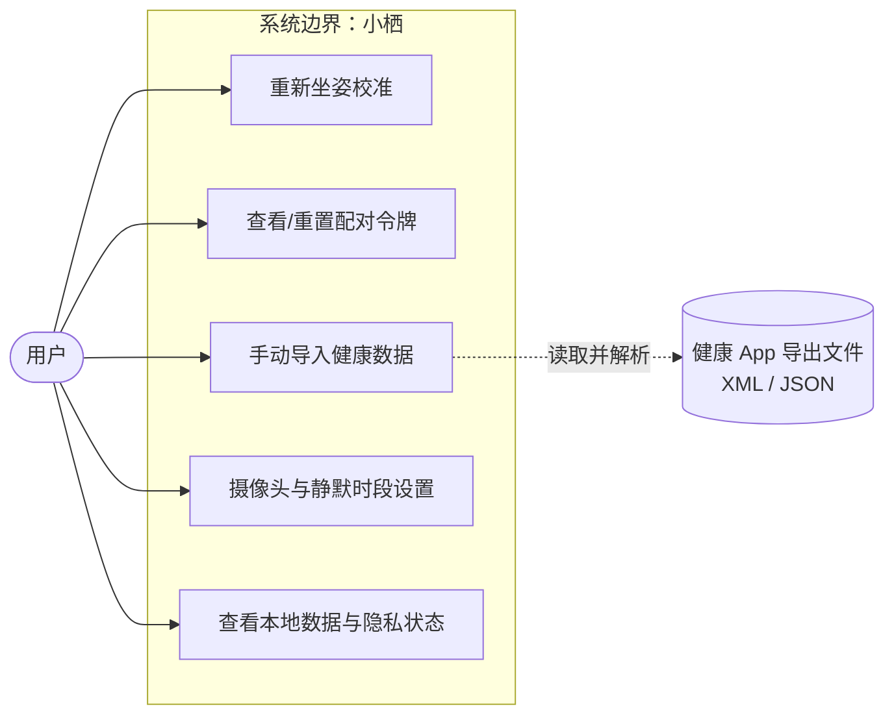

# 小栖 · UML 需求建模（系统边界 / Actor / 用例）

> **来源**：2026-09-16 成稿 → 从个人知识库迁入团队仓库
> **状态**：系统边界 + Actor + 2 张用例图 + 9 条用例清单已成稿；
> **待补**：用例规格（UC-01/02/06 等）、业务规则 BR、量化 NFR
> **主笔**：成员 C ｜ **需评审**：A、B
>
> 相关：[需求分析](需求分析.md) ｜ [系统架构](系统架构.md) ｜ [接口协议](接口协议.md) ｜ 项目事实见 [仓库 README](../../README.md)
> 方法来源：实训课课件《校园运动场地预约系统-UML需求建模》（课件本身为课程参考材料，不入本仓库）。

## 一、系统边界

小栖是运行在 Windows 上的本地健康陪伴应用：摄像头、电脑系统、手机侧工具三路数据汇入，驱动 2.5D/3D 房间里的健康伙伴。系统不做云端、不做账号。

### 1.1 系统上下文

### 1.2 In Scope / Out of Scope

| In Scope（本期实现） | Out of Scope（本期不做） |
|---|---|
| 摄像头实时姿态检测与首次坐姿校准 | 自研手机原生 App |
| 房间与健康伙伴实时渲染、状态机驱动 | 云端账号 / 多设备同步 |
| 久坐、喝水的角色化提醒 | 社交分享 / 好友排行 |
| Windows 前台应用使用时长统计 | 健康周报 / PDF 导出 |
| 手机步数 HTTP 上报（令牌 + 幂等） | AI 姿态矫正建议 |
| 当日健康概览、提醒偏好设置 | 多用户 / 手表手环接入 |

## 二、Actor 识别

| Actor | 版型 | 与系统的交互 |
|---|---|---|
| 用户（大学生 / 办公族） | 人 | 安装、首次校准、日常观看房间、标记喝水、调整设置 |
| 外置 USB 摄像头 | «device» | 小栖主动读取视频帧做姿态估计 |
| Windows 操作系统 | «system» | 提供前台应用焦点与系统时间，不上传窗口内容 |
| 手机侧自动化工具 | «external system» | iOS 快捷指令 / Android HTTP Shortcuts，定时 POST 步数 |

> 大学生与办公族行为完全一致，不单列泛化 Actor；手机本身不是 Actor，真正在边界外对话的是「读健康库 + 发 HTTP」的自动化配置。

## 三、用例图

### 3.1 用户主链用例图

### 3.2 设置与兜底用例图

### 3.3 用例清单

| 编号 | 用例名 | 主要 Actor |
|---|---|---|
| UC-01 | 首次启动与坐姿校准 | 用户 |
| UC-02 | 实时观看房间与健康伙伴 | 用户 |
| UC-03 | 标记已喝水 | 用户 |
| UC-04 | 查看当日健康概览 | 用户 |
| UC-05 | 调整提醒偏好 | 用户 |
| UC-06 | 配对手机接入 / 接收步数上报 | 用户 + 手机侧工具 |
| UC-07 | 重新坐姿校准 | 用户 |
| UC-08 | 管理配对令牌 | 用户 |
| UC-09 | 手动导入健康数据（兜底） | 用户 |
