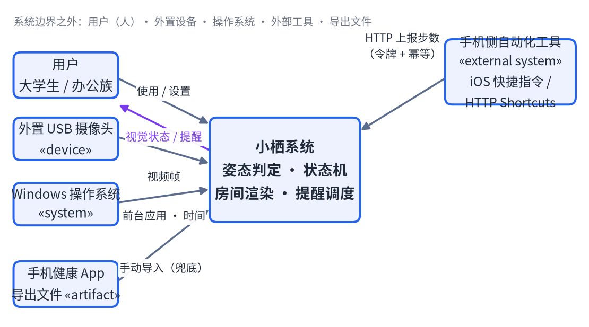
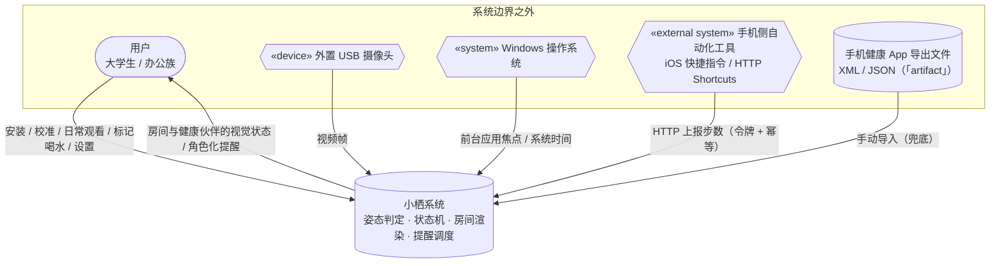
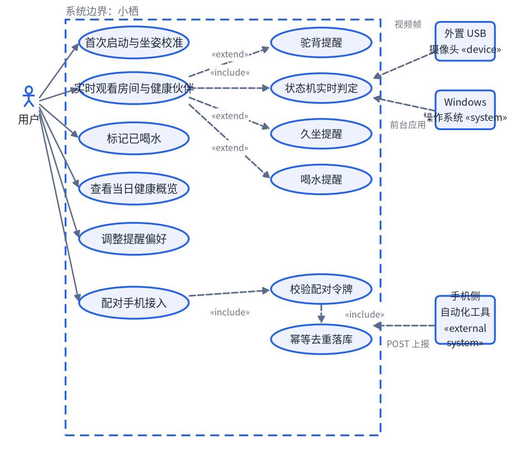
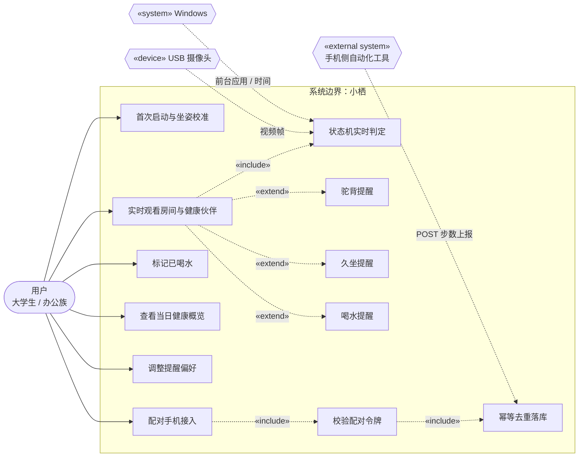
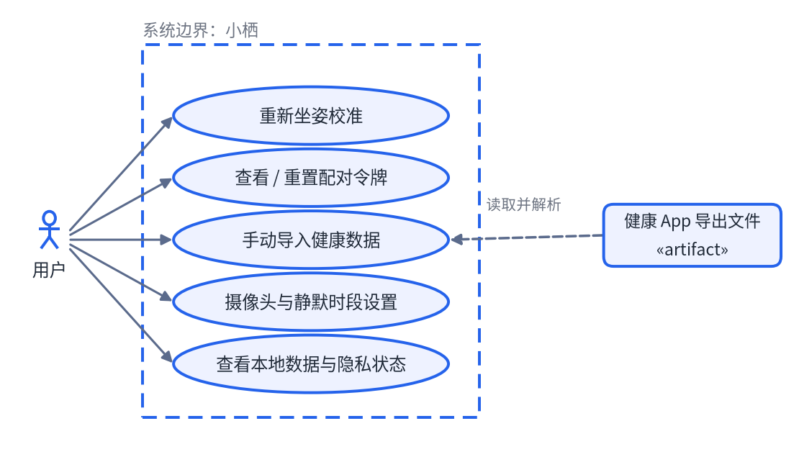
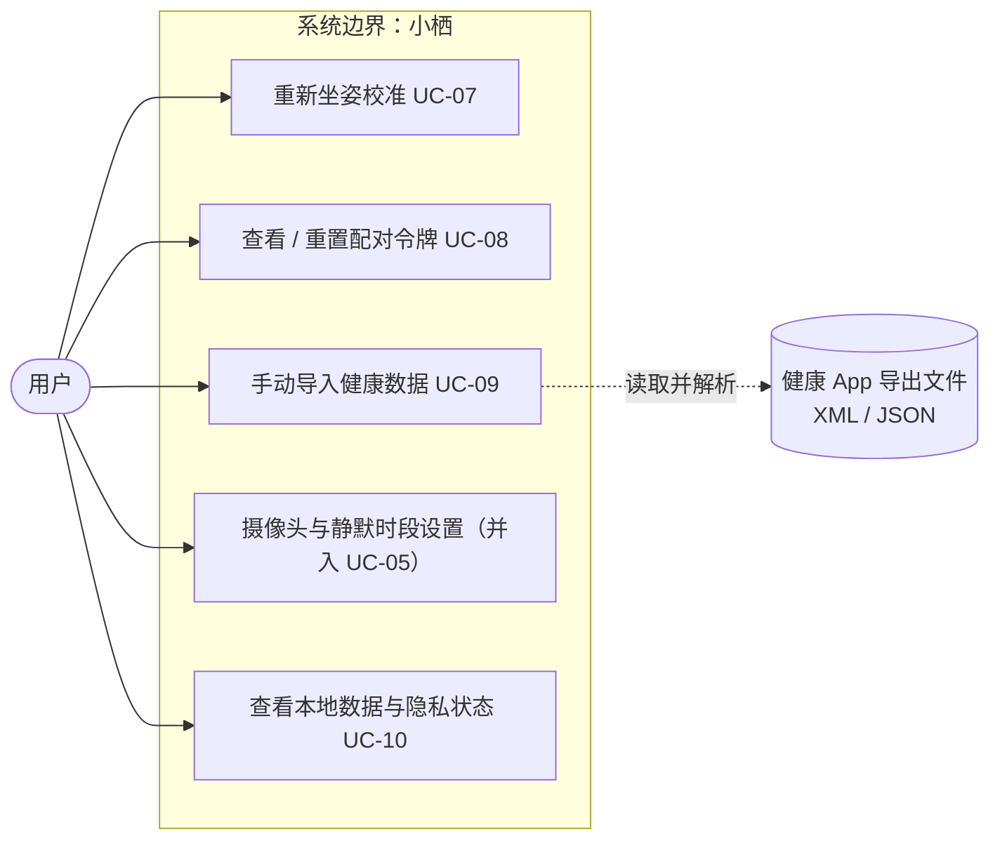
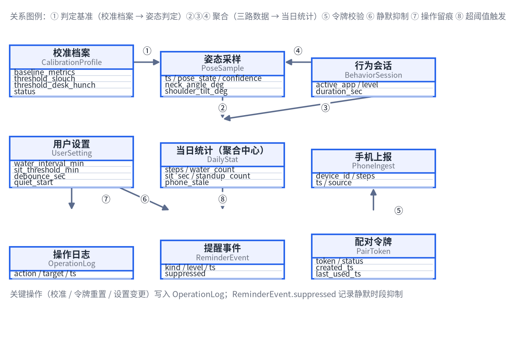
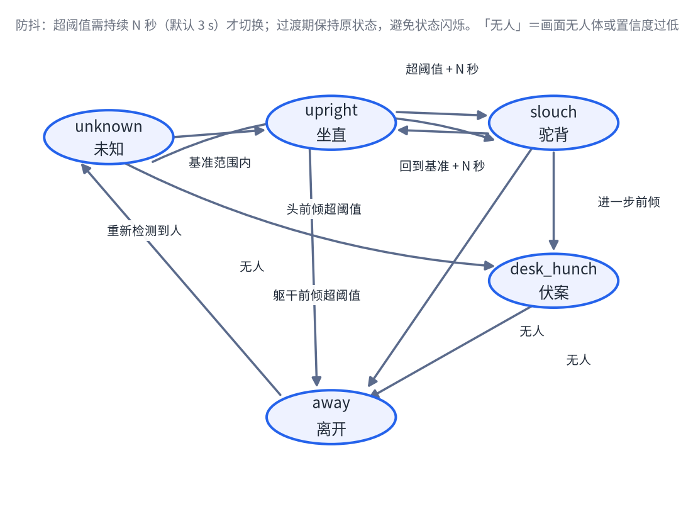

# 小栖 · 需求规格说明书

**Software Requirements Specification (SRS)**

> **来源**：实训课交付物 D1。在 [需求分析](需求分析.md)（需求链 02–05 步）与 [UML建模](UML建模.md)（06 步）基础上补齐 **07 需求规格**（UC 规格 / FR / BR / 量化 NFR）与 **08 验收标准**（AC / TC），并合并为一份 SRS。
> **状态**：V1.0 初稿，待 A、B 评审（交付物规则：每份交付物必须有评审人）
> **主笔**：张鹏（团队内代号「成员 C」）｜ **需评审**：A、B
> **写作纪律**：文中的阈值、帧率、延迟等数字**必须能从代码/配置文件/实测数据复现**；凡未定者一律标 **【待确认】**，不猜。
>
> 相关：[需求分析](需求分析.md) ｜ [UML建模](UML建模.md) ｜ [系统架构](系统架构.md) ｜ [接口协议](接口协议.md) ｜ [里程碑与验收标准](../01-规划/里程碑与验收标准.md) ｜ [风险与决策](../01-规划/风险与决策.md)
> 结构参考：实训课课件案例《校园运动场地预约系统 · 需求规格说明书》（课件为课程参考材料，不入本仓库）。

## 文档信息

| 项目 | 内容 |
|---|---|
| 项目名称 | 小栖 · 陪伴式集中展示多源健康数据 |
| 文档名称 | 需求规格说明书（Software Requirements Specification） |
| 文档版本 | V1.0 |
| 编写人 | 张鹏（云南大学软件学院 · 数字媒体技术） |
| 审核人 | 待队友评审后填写（成员 A、B） |
| 所属单位 / 课程 | 云南大学软件学院 · 数字媒体中级实训（实训课） |
| 编写日期 | 2026 年 09 月 20 日 |

---

## 文档说明

本说明书沿需求工程链 **Actor → Use Case → Use Case Specification → Requirement → Acceptance**，把小栖的「系统边界、参与者、用例、业务规则与业务流程」落到可开发、可测试的 SRS 文档中。

### 需求类型与编号约定

| 类型 | 含义 |
|---|---|
| 用例（UC） | 描述"谁为了什么目标，如何与系统交互"。 |
| 功能需求（FR） | 描述"系统应提供什么具体能力"。 |
| 业务规则（BR） | 描述业务约束、判断条件、限制和政策。 |
| 非功能需求（NFR） | 描述性能、安全、可靠性、可用性、兼容性等质量要求。 |
| 验收标准（AC） | 描述如何判断需求已经正确实现。 |
| 测试用例（TC） | 将验收标准转化为可执行测试。 |
| 接口（IF）/ 数据对象 | 描述外部交互契约与概念数据模型。 |

### 编号规则

| 前缀 | 含义 | 举例 |
|---|---|---|
| `A-xx` | Actor / 干系人 | `A-01` 用户 |
| `UC-xx` | 用例 | `UC-02` 实时观看房间 |
| `FR-xx` | 功能需求 | `FR-02` 姿态检测与状态判定 |
| `BR-xx` | 业务规则 | `BR-02` 状态防抖 |
| `NFR-x-xx` | 非功能需求（P 性能 / S 安全 / R 可靠 / U 可用 / C 兼容 / M 可维护） | `NFR-P-03` |
| `IF-xx` / `ID-xx` | 外部接口 / 接口异常与依赖 | `IF-03` 手机侧上报 |
| `AC-xx` / `TC-xx` | 验收标准 / 测试用例 | `AC-02` |
| `C-xx` / `Q-xx` | 约束与假设 / 待确认问题 | `Q-01` |

### 文档修订记录

| 版本 | 日期 | 修改人 | 修改内容 |
|---|---|---|---|
| V1.0 | 2026-09-20 | 成员 C | 合并 [需求分析](需求分析.md)、[UML建模](UML建模.md)，补齐 07 需求规格与 08 验收标准（FR / BR / 量化 NFR / AC / TC / 追踪矩阵）。 |

---

## 目录

1. 项目背景与目标
2. 术语与定义
3. 用户与干系人
4. 系统范围与边界
5. UML 用例模型
6. 用例与功能规格
7. 非功能需求
8. 数据与外部接口
9. 验收与追踪
10. 附录

---

## 1 项目背景与目标

### 1.1 项目背景

长期伏案的大学生与办公族，健康风险主要来自"察觉不到"：坐姿是否已经驼背、这一坐是连续多久、一天到底喝了多少水、走了多少步——这些数据要么没人测，要么散落在摄像头、操作系统、手机等互不相通的设备和应用里。市面上并不缺"检测"工具，缺的是**让人愿意一直看着、并且看得懂**的呈现方式：传统健康软件和弹窗提醒通常在打开一次后就被关闭，无法形成长期关注。

小栖的定位不是"一个驼背检测工具"，而是**一个你生活其中的、有角色有世界的陪伴空间**：在 Windows 上运行一个低多边形 3D 房间，房间里的「健康伙伴」由姿态、久坐、喝水、电脑使用、手机步数等多源数据实时驱动。它把多源健康数据**集中获取 + 卡通化呈现**，用角色的状态变化代替生硬的弹窗，让用户在"正常生活"的过程中被动感知并主动调整习惯。

> 一句话需求：**陪伴式集中展示多源健康数据。**

### 1.2 业务痛点

| 编号 | 当前问题 | 影响 |
|---|---|---|
| P-01 | 坐姿不良（长期驼背、伏案）但用户自身察觉不到，也无人提醒。 | 颈椎、腰椎慢性损伤，且无即时反馈可供纠正。 |
| P-02 | 久坐不动，一坐数小时，缺乏起身活动的节奏意识。 | 血液循环不畅，疲劳累积，效率下降。 |
| P-03 | 专注工作/学习时忘记喝水，一天下来水杯还是满的。 | 长期缺水，注意力与身体状态受损。 |
| P-04 | 日常步数偏低且没有直观数据反馈，活动量不可见。 | 运动不足无法被自己发现，更谈不上改善。 |
| P-05 | 坐姿、久坐、喝水、步数数据分散在不同设备与 App，无法集中查看。 | 数据割裂 → 用户没有统一"健康概览"，无法形成整体认知。 |
| P-06 | 传统弹窗式提醒容易被忽略、甚至被关闭，缺乏持续关注的动力。 | 提醒失效，健康管理无法长期坚持。 |

### 1.3 建设目标

1. 在**单台 Windows 电脑**上完成多源健康数据的集中获取：摄像头（姿态）、操作系统（前台应用与时长）、手机侧工具（步数）。
2. 形成"**多源输入 → 状态计算 → 视觉展示 → 行为提醒 → 行为变化被重新采集**"的完整闭环。
3. 把"是否驼背、是否久坐、是否该喝水"等判断规则固化进系统（个人化校准 + 防抖 + 阈值 + 间隔），减少"靠感觉"的不确定性。
4. 用 3D 房间与健康伙伴的**状态变化**承载数据，把提醒从"打断"变成"看见"，提高用户的接受度与坚持度。
5. 全过程**不依赖云端与账号**，摄像头画面与行为细节不出本机。

### 1.4 成功指标

| 编号 | 指标 | 目标值 / 验收口径 |
|---|---|---|
| KPI-01 | 核心陪伴闭环可跑通 | 在单台机器上完成：安装启动 → 首次校准 → 实时展示 → 提醒触发 → 用户调整 → 状态恢复；全程无需账号与云端。 |
| KPI-02 | 姿态判定可用性 | 实测 ≥ 30 分钟连续记录，误报率 ≤ 20%、漏报率 ≤ 10%，且调校后优于调校前（给出两组数）。**上列为初始门槛，M2 实测后定档。** |
| KPI-03 | 多源汇聚与隔离 | 摄像头 / Windows 行为 / 手机步数三路数据都能在房间内被看见；任一路中断，其余照常工作。 |
| KPI-04 | 体验底线 | 首次校准 ≤ 2 分钟完成；连续运行 ≥ 30 分钟帧率 ≥ 30 FPS 且内存不持续增长。 |
| KPI-05 | 作品感（多媒体课评分点） | 低多边形房间场景完整（墙角 + 桌椅 + 电脑 + 光照）；健康伙伴 ≥ 4 个姿态状态有不同表现且切换有过渡补间。 |

---

## 2 术语与定义

本章统一角色、用例、状态与业务对象，避免"坐姿正常""驼背""提醒"等概念在开发与测试阶段出现歧义。

| 术语 / 缩写 | 定义 |
|---|---|
| Actor | 系统之外、与系统发生交互的角色或外部系统（人 / «device» 设备 / «system» 操作系统 / «external system» 外部工具）。 |
| Use Case | 系统向 Actor 提供的一项完整业务能力。 |
| SRS | Software Requirements Specification，软件需求规格说明书。 |
| FR / BR / NFR / AC / TC | 功能需求 / 业务规则 / 非功能需求 / 验收标准 / 测试用例。 |
| 小栖 | 本项目：运行在 Windows 上的本地健康陪伴应用（系统边界内的整体）。 |
| 房间世界 | 小栖的呈现层：低多边形 3D 卡通房间（墙角 + 桌椅 + 电脑 + 光照），3D 优先，2.5D 等距精灵为降级预案（见 [D-001](../01-规划/风险与决策.md)）。 |
| 健康伙伴 | 房间中的卡通角色，其姿态、动作、表情随多源健康状态切换，是数据的"翻译器"。 |
| 姿态状态 `pose_state` | 由姿态判定输出的枚举：`unknown`（未知）/ `upright`（坐直）/ `slouch`（驼背）/ `desk_hunch`（伏案）/ `away`（离开）/ `drinking`（喝水，可选）。 |
| 行为等级 `behavior_level` | 前台应用连续使用时长的三档：`ok` / `warn` / `alert`。 |
| 个人化校准 | 首次启动引导用户"坐直"采样基准几何量，生成个性化阈值（而非全局固定阈值）。 |
| 防抖 | 判定量超过阈值后必须**持续 N 秒**才认定状态切换，用于抑制瞬时误报。 |
| 多源数据 | 三路独立输入：① 摄像头姿态 ② Windows 前台应用与时长 ③ 手机步数（经 HTTP 上报）。 |
| 链路 | 上述每一路数据从采集到呈现的完整路径（姿态链 / 行为链 / 手机链）。 |
| 手机侧自动化工具 | «external system»：iOS 快捷指令 / Android HTTP Shortcuts，读取本机健康库并定时 POST 步数。**手机端不开发 App**（见 [D-002](../01-规划/风险与决策.md)）。 |
| 配对令牌 | 后端首次启动生成的访问令牌，用于校验手机上报来源合法性。 |
| 幂等 | 同一 `device_id` 在 60 秒窗口内的重复上报被丢弃，不覆盖已有值。 |
| 静默时段 | 用户设定的不触发提醒事件的时间段；期间房间视觉状态照常变化。 |
| stale（数据过期） | 手机步数超过 15 分钟未更新时标记的状态，前端据此提示"待同步"。 |
| 降级 | 3D 或姿态判定不达标时的预案：切 2.5D 渲染、或收窄姿态状态数（见 [里程碑与验收标准](../01-规划/里程碑与验收标准.md)）。 |

---

## 3 用户与干系人

### 3.1 用户角色（Actor）

| Actor 编号 | Actor 名称 | 类型 | 主要职责 |
|---|---|---|---|
| A-01 | 用户 | 抽象用户角色 | 安装启动、首次校准、日常观看房间、标记喝水、调整设置。 |
| A-01a | 大学生 | 用户 | 长时间伏案学习/写论文/敲代码场景下的使用者；行为与办公族一致，不单列泛化 Actor。 |
| A-01b | 办公族 | 用户 | 重度使用电脑、工作日均屏幕时间长场景下的使用者。 |
| A-02 | 外置 USB 摄像头 | «device» | 小栖主动读取视频帧做姿态估计；不产生业务动作。 |
| A-03 | Windows 操作系统 | «system» | 提供前台应用焦点与系统时间；**不上传窗口内容**。 |
| A-04 | 手机侧自动化工具 | «external system» | iOS 快捷指令 / Android HTTP Shortcuts 读取本机健康库，定时 POST 步数。 |
| A-05 | 手机健康 App 导出文件 | «artifact» | 无自动化条件时，用户导出 XML / JSON，由小栖手动导入（兜底路径）。 |

> **说明**：① 大学生与办公族行为完全一致，不单列泛化 Actor；② 手机本身不是 Actor——真正在边界外对话的是"读健康库 + 发 HTTP"的自动化配置；③ 手机侧工具是**数据源**，不是客户端。

### 3.2 角色—能力矩阵

| 能力 / 角色 | 用户（A-01） | 摄像头（A-02） | Windows（A-03） | 手机侧工具（A-04） |
|---|---|---|---|---|
| 首次启动与坐姿校准 | √ | 提供视频帧 | — | — |
| 实时观看房间与健康伙伴 | √ | 提供视频帧 | 提供前台应用/时间 | — |
| 标记已喝水 | √ | — | — | — |
| 查看当日健康概览 | √ | — | — | — |
| 调整提醒偏好 / 静默时段 | √ | — | — | — |
| 配对手机接入 / 上报步数 | √（配对） | — | — | √（上报） |
| 管理配对令牌 | √ | — | — | —（凭令牌访问） |
| 重新校准 / 手动导入数据 | √ | 提供视频帧 | — | — |
| 查看本地数据与隐私状态 | √ | — | — | — |

> 权限边界：外部系统只提供数据或接收数据，**不具备任何业务配置能力**；令牌是唯一的对外访问凭据。

### 3.3 其他干系人

| 干系人 | 关注内容 | 需求来源 / 沟通方式 |
|---|---|---|
| 团队开发成员（A / B / C） | 需求可实现性、接口稳定性、阈值可调、验收可跑 | 仓库 `docs/` 评审、周三联调、看板卡 |
| 实训课 / 人机课 / 多媒体课教师 | 需求链完整性与工程规范、交互闭环的可用性证据、作品的视觉与叙事 | 课程要求、课堂口头反馈（24 小时内落进 [风险与决策](../01-规划/风险与决策.md)） |
| 演示与答辩场景 | 一台干净机器上从零跑通、现场不掉链子 | [里程碑与验收标准](../01-规划/里程碑与验收标准.md) M4 |
| 用户隐私相关方（用户本人 / 课程伦理要求） | 摄像头画面与窗口内容不外传、不留存 | [系统架构](系统架构.md)「关键运行约束」 |

---

## 4 系统范围与边界

> 核心原则：先界定本期"做什么、不做什么"。用例图必须服从系统范围，Out of Scope 不应被理解为本期系统能力。

### 4.1 系统上下文（Context）



**图 4-1　小栖系统上下文图**



### 4.2 In Scope——本期实现

| 编号 | 本期功能 / 能力 | 说明 |
|---|---|---|
| S-01 | 摄像头实时姿态检测 | 外置 USB 摄像头取帧 → 人体关键点 → 姿态状态判定。 |
| S-02 | 首次坐姿校准与重新校准 | 引导"坐直"采样基准，生成个性化阈值；支持重做。 |
| S-03 | 房间与健康伙伴实时渲染 | 低多边形 3D 房间（3D 优先），伙伴状态随数据切换。 |
| S-04 | 状态机驱动与过渡 | 防抖 + 持续时长 + 状态迁移，动画有过渡补间。 |
| S-05 | 久坐提醒 | 连续坐姿超阈值触发，以角色行为/房间变化呈现。 |
| S-06 | 喝水提醒与标记 | 按间隔提醒，用户可标记"已喝水"重置计时。 |
| S-07 | Windows 前台应用使用时长统计 | 本地轻量统计，不上传、不记录窗口内容。 |
| S-08 | 手机步数 HTTP 上报接入 | 带令牌的 `POST /api/ingest/health`，幂等去重。 |
| S-09 | 当日健康概览 | 当日步数、喝水次数、坐姿/久坐时长等集中呈现。 |
| S-10 | 提醒偏好与静默时段设置 | 间隔、开关、静默时段可配置。 |
| S-11 | 异常兜底与链路降级 | 摄像头断流、手机断连、单链路故障不导致整体不可用。 |
| S-12 | 手动导入健康数据（兜底） | 读取健康 App 导出的 XML / JSON 文件。 |

### 4.3 Out of Scope——本期不实现

| 编号 | 本期不实现内容 | 原因 / 后续计划 |
|---|---|---|
| OS-01 | 自研手机原生 App | 工期不够、需过审核上架；改用系统现成工具零开发接入（D-002）。 |
| OS-02 | 云端账号 / 多设备同步 | 本期定位为纯本地单机应用；引入云端会带来隐私与工期风险。 |
| OS-03 | 社交分享 / 好友排行 | 与"陪伴而非监督"的定位冲突，非核心闭环。 |
| OS-04 | 健康周报 / PDF 导出 | 数据积累周期不足，本期内数据仅当日与本地留存。 |
| OS-05 | AI 姿态矫正建议 | 依赖模型与语料，超出课程工期；本期只做状态反馈。 |
| OS-06 | 多用户 / 手表手环接入 | 无账号体系；手环数据源不在本期三路之内。 |
| OS-07 | 逐帧骨骼绑定动画 | 成本极高；本期采用"有限状态 + 有限动画片段 + 过渡补间"。 |
| OS-08 | 前端反向控制后端 | 接口 v0.1 定为前端只读，不做反向控制（见 [接口协议](接口协议.md)）。 |

### 4.4 MVP——最小可用闭环

```
01 装好摆好 → 02 坐直校准 → 03 正常用电脑 → 04 看见状态 → 05 收到提醒并调整
```

| 步骤 | 说明 |
|---|---|
| 01 装好摆好 | 在 Windows 上启动小栖，摆好外置摄像头（对准上半身），手机侧工具完成上报配置与配对。 |
| 02 坐直校准 | 按提示坐直采样基准，得到个人化阈值（≤ 2 分钟）。 |
| 03 正常用电脑 | 用户不做任何额外操作，系统后台持续采集姿态、久坐、行为、步数。 |
| 04 看见状态 | 房间中的健康伙伴实时反映坐姿/久坐/运动状态，数据被"翻译"成角色行为。 |
| 05 收到提醒并调整 | 角色以行动/表情提示起身活动或喝水；用户调整后状态恢复，形成闭环。 |

> **MVP ≠ 功能少，MVP = 最小价值闭环。** 本 MVP 的验证口径即 KPI-01。

**非 MVP 功能（本期已排除在 Out of Scope 或列为低优先级）：** AI 矫正建议、健康周报导出、社交分享、多用户与手环接入（OS-02～OS-06）。

### 4.5 约束与假设

| 编号 | 类型 | 内容 |
|---|---|---|
| C-01 | 约束 | 平台为 Windows 为主 + 外置 USB 摄像头；系统为**本地单机应用**，不做云端、不做账号。 |
| C-02 | 约束 | **不依赖独立 GPU**——不能假设演示机器有独显，姿态估计必须 CPU 可跑。 |
| C-03 | 约束 | 手机与电脑需处于**同一 Wi-Fi**；后端只监听局域网，不暴露公网。 |
| C-04 | 约束 | 手机端**零开发**（iOS 快捷指令 / Android HTTP Shortcuts），因此必须容忍多次上报与长时间断流。 |
| C-05 | 约束 | 隐私硬约束：摄像头画面不上传、不留存；行为采集只记录应用名与时长，不记录窗口内容。 |
| C-06 | 约束 | iOS 定时自动化需手机解锁才可靠触发 → 上报不可靠是**设计前提**，不是缺陷。 |
| A-01 | 假设 | 用户的摄像头视野可覆盖上半身，且光照条件允许关键点稳定输出。 |
| A-02 | 假设 | 目标机器可安装 Python 3.11+ 与 Node.js 18+，浏览器为 Chrome / Edge 近期版本。 |
| A-03 | 假设 | 用户手机上存在可读取步数的健康库，且允许快捷指令 / HTTP Shortcuts 访问。 |

---

## 5 UML 用例模型

### 5.1 用户主链用例图



**图 5-1　用户主链 UML 用例图**



### 5.2 设置与兜底用例图



**图 5-2　设置与兜底 UML 用例图**



### 5.3 UML 元素说明

| 元素 | 含义 | 本案例使用方式 |
|---|---|---|
| Actor | 系统之外、与系统发生交互的角色。 | 用户（抽象）+ 摄像头 «device» + Windows «system» + 手机侧自动化工具 «external system»。 |
| Use Case | 系统向 Actor 提供的一项完整业务能力。 | 采用"动词 + 名词"命名，如"标记已喝水"。 |
| Association | Actor 与 Use Case 之间的关联。 | 表示谁使用哪个能力。 |
| «include» | 基础用例**必然**调用的公共子能力。 | 实时观看房间必然包含状态机实时判定；配对手机必然包含令牌校验与幂等落库。 |
| «extend» | 仅在特定条件下发生的附加流程。 | 驼背 / 久坐 / 喝水三个提醒并非每次发生，是条件触发的扩展流程。 |
| System Boundary | 矩形框内是本系统职责。 | 框外为用户与三类外部数据源。 |

### 5.4 用例清单

| 用例编号 | 用例名称 | 主要 Actor | 优先级 | 简要说明 |
|---|---|---|---|---|
| UC-01 | 首次启动与坐姿校准 | 用户 | 高 | 引导坐直采样基准，生成个人化阈值，进入房间。 |
| UC-02 | 实时观看房间与健康伙伴 | 用户 | 高 | 房间与伙伴随多源状态实时变化，是核心陪伴体验。 |
| UC-03 | 标记已喝水 | 用户 | 中 | 手动确认喝水，重置喝水计时并累计当日次数。 |
| UC-04 | 查看当日健康概览 | 用户 | 中 | 当日步数、喝水次数、坐姿/久坐时长集中呈现。 |
| UC-05 | 调整提醒偏好 | 用户 | 中 | 调整提醒间隔、开关与静默时段。 |
| UC-06 | 配对手机接入 / 接收步数上报 | 用户 + 手机侧工具 | 中 | 生成并校验令牌，接收步数，幂等去重落库。 |
| UC-07 | 重新坐姿校准 | 用户 | 中 | 更换姿势/座位/摄像头后重新采样基准。 |
| UC-08 | 管理配对令牌 | 用户 | 低 | 查看、重置令牌（重置后旧令牌立即失效）。 |
| UC-09 | 手动导入健康数据（兜底） | 用户 | 低 | 读取健康 App 导出的 XML / JSON 文件补齐步数。 |
| UC-10 | 查看本地数据与隐私状态 | 用户 | 低 | 查看本地留存范围与隐私状态（画面不落盘、行为数据不含窗口内容）。 |

> 图 5-2 中的「摄像头与静默时段设置」并入 **UC-05 调整提醒偏好**（静默时段是提醒偏好的一部分，不单列为用例）。

---

## 6 用例与功能规格

> 说明：覆盖主链与手机链的关键用例（UC-01 / UC-02 / UC-03 / UC-06）给出完整用例规格；其余用例以清单形式在 6.6 中给出功能需求。

### 6.1 UC-01 首次启动与坐姿校准

| 字段 | 内容 |
|---|---|
| 用例编号 | UC-01 |
| 用例名称 | 首次启动与坐姿校准 |
| 主要 Actor | 用户 |
| 支持 Actor | 外置 USB 摄像头 |
| 目标 | 在系统首次运行时建立**个人化姿态基准**，使后续判定不依赖通用阈值。 |
| 触发 | 用户首次启动小栖（无有效校准档案）。 |
| 前置条件 | 外置摄像头已被系统识别；画面中可检测到用户上半身。 |
| 后置条件 | 生成校准档案（基准几何量 + 阈值），系统进入房间界面并开始实时展示。 |
| 优先级 | 高 |

#### 基本流程（Main Flow）

1. 系统检测到无有效校准档案，进入引导流程，提示用户调整摄像头位置（对准上半身）。
2. 系统实时显示检测状态（是否检测到人、关键点是否稳定）。
3. 系统提示用户"坐直"，倒计时采样若干秒，采集基准几何量（如头前倾角、肩线倾角、距离）。
4. 系统基于基准生成个性化阈值并落盘为校准档案。
5. 系统进入房间界面，健康伙伴出现并开始反映当前状态。

#### 备选 / 异常流程（Alternative / Exception）

| 编号 | 触发条件 | 系统处理 | 结果 |
|---|---|---|---|
| A1 | 首次启动时可选择"跳过校准" | 使用保守的默认阈值并明确提示精度会下降 | 进入房间，校准档案标记为 `default`，房间内提示可重新校准 |
| E1 | 采样期间未检测到人 / 关键点不稳定 | 提示调整位置与光线，不生成档案，允许重试 | 停留在引导流程，不进入房间 |
| E2 | 摄像头未连接 / 打不开 | 提示摄像头异常，允许"无摄像头继续" | 进入房间，姿态链不可用（`capabilities` 不含 `pose`），其余链路照常 |

### 6.2 UC-02 实时观看房间与健康伙伴

| 字段 | 内容 |
|---|---|
| 用例编号 | UC-02 |
| 用例名称 | 实时观看房间与健康伙伴 |
| 主要 Actor | 用户 |
| 支持 Actor | 外置 USB 摄像头、Windows 操作系统 |
| 目标 | 把多源健康数据实时翻译成角色与房间的视觉状态，让用户"愿意看"。 |
| 触发 | 系统运行中，用户在电脑前正常工作/学习。 |
| 前置条件 | 已完成校准；后端服务运行；前端页面已连接。 |
| 后置条件 | 房间与伙伴状态与当前多源数据一致；必要时触发角色化提醒；数据被记录用于当日概览。 |
| 优先级 | 高 |

#### 基本流程（Main Flow）

1. 后端持续从摄像头获取视频帧并估计人体关键点，结合系统时间与前台应用焦点计算各状态量。
2. 状态机按防抖与持续时长规则判定 `pose_state`、`behavior_level`、久坐与喝水计时。
3. 后端通过 WebSocket 推送状态（连接建立时全量 `hello`，其后只推变化字段）。
4. 前端根据状态切换健康伙伴的动画与房间环境（光照/氛围），切换带过渡补间。
5. 系统持续记录姿态历史、行为时长、喝水次数与步数，供当日概览与实测统计使用。

#### 备选 / 异常流程（Alternative / Exception）

| 编号 | 触发条件 | 系统处理 | 结果 |
|---|---|---|---|
| A1 | 判定为驼背 / 伏案并持续超过防抖时长 | 触发驼背提醒（«extend»） | 伙伴弯腰/疲惫表现，温和提示调整坐姿 |
| A2 | 连续坐姿时长达到阈值 | 触发久坐提醒（«extend»） | 伙伴表现想活动，房间出现动态提示 |
| A3 | 到达喝水间隔 | 触发喝水提醒（«extend»） | 伙伴做出递水杯/喝水动作 |
| A4 | 画面中检测不到人 | 暂停姿态判定，状态置 `away` | 伙伴进入"等待"状态；离开时间计入久坐/起身统计 |
| A5 | 手机步数断流 | 步数模块标记 `stale` 并显示最后同步时间 | 姿态链与行为链不受影响 |
| E1 | 摄像头断流 / 被遮挡 | 推送 `error`（`POSE_LOST`），前端提示摄像头异常 | 姿态检测暂停，其余功能正常运行 |
| E2 | 与前端连接断开（10 秒无消息） | 前端自动重连（2 s 起递增，最长 30 s） | 恢复后重新下发全量 `hello` |

### 6.3 UC-03 标记已喝水

| 字段 | 内容 |
|---|---|
| 用例编号 | UC-03 |
| 用例名称 | 标记已喝水 |
| 主要 Actor | 用户 |
| 支持 Actor | 无 |
| 目标 | 由用户确认饮水事实，重置喝水计时并累计当日次数。 |
| 触发 | 用户实际喝水后主动标记（房间内交互或概览页按钮）。 |
| 前置条件 | 系统运行中，当日记录可用。 |
| 后置条件 | 当日喝水次数 +1；喝水计时重置；房间中出现相应视觉反馈。 |
| 优先级 | 中 |

#### 基本流程（Main Flow）

1. 用户点击"已喝水"。
2. 系统将当日喝水次数 +1 并记录时间戳。
3. 系统重置喝水计时，下一次提醒从当前时刻起重新计间隔。
4. 房间与伙伴给出即时正向反馈（如角色举杯、水杯元素短暂高亮）。

#### 备选 / 异常流程（Alternative / Exception）

| 编号 | 触发条件 | 系统处理 | 结果 |
|---|---|---|---|
| A1 | 短时间内重复标记 | 允许累计但提示是否存在误触（**是否做去重【待确认】**） | 次数以用户确认为准 |
| E1 | 写入本地存储失败 | 提示记录失败并允许重试 | 计时不重置，避免"提醒被静默吞掉" |

### 6.4 UC-06 配对手机接入 / 接收步数上报

| 字段 | 内容 |
|---|---|
| 用例编号 | UC-06 |
| 用例名称 | 配对手机接入 / 接收步数上报 |
| 主要 Actor | 用户 + 手机侧自动化工具 |
| 支持 Actor | 无 |
| 目标 | 以**零客户端开发**的方式把手机步数接入系统，且容忍重复上报与长时间断流。 |
| 触发 | 用户在手机侧配置好快捷指令 / HTTP Shortcuts 并首次上报。 |
| 前置条件 | 后端服务已启动；手机与电脑处于同一 Wi-Fi；后端已生成配对令牌。 |
| 后置条件 | 步数落库并可在房间/概览中看到；重复上报被幂等丢弃；错误令牌被拒绝。 |
| 优先级 | 中 |

#### 基本流程（Main Flow）

1. 后端首次启动生成配对令牌，打印在控制台并显示二维码。
2. 用户按模板在手机侧配置自动化：读取当日步数 → `POST /api/ingest/health`（携带 `X-Xiaoqi-Token`）。
3. 后端校验令牌 → 校验字段 → 幂等判断 → 写入当日步数记录。
4. 后端通过 WebSocket 推送更新后的 `phone` 字段，前端刷新步数可视化。
5. 后端在收到上报时更新 `updated_ts`，据此维护 `stale` 状态。

#### 备选 / 异常流程（Alternative / Exception）

| 编号 | 触发条件 | 系统处理 | 结果 |
|---|---|---|---|
| A1 | 60 秒窗口内同一 `device_id` 重复上报 | 幂等丢弃，返回 `{"ok":true,"deduped":true}` | 已有值不被覆盖 |
| A2 | `steps` 小于已存值（跨零点 / 系统重置） | 视为新的一天，开新记录 | 不修正历史值 |
| A3 | 长时间未上报（> 15 分钟） | 标记 `stale` | 前端显示"待同步"，其余功能不受影响 |
| E1 | 令牌缺失或错误 | 返回 401 `BAD_TOKEN` | 数据不落库 |
| E2 | 字段缺失 / 类型错误 | 返回 400 `INVALID_FIELD` 并指出字段名 | 数据不落库 |
| E3 | 手机与电脑不在同一 Wi-Fi / 服务未启动 | 手机侧请求失败 | 用户可用 UC-09 手动导入兜底 |

### 6.5 功能需求（详细示例：FR-02 姿态检测与状态判定）

以下以 FR-02 为详细示例，其余功能需求在 6.6 中给出清单。

| 字段 | 填写内容 |
|---|---|
| 需求编号 | FR-02 |
| 需求名称 | 姿态检测与状态判定 |
| 来源用例 | UC-02 |
| 需求描述 | 系统应基于外置摄像头的视频帧实时估计人体关键点，并结合个人化校准基准与防抖规则，输出当前姿态状态（`upright` / `slouch` / `desk_hunch` / `away` / `unknown`），用于驱动房间与伙伴呈现。 |
| 输入 | 摄像头视频帧；校准档案（基准几何量与阈值）；当前系统时间。 |
| 处理 | 关键点估计 → 计算几何量（头前倾角、肩线倾角、距离等）→ 与个人化阈值比较 → 持续时长防抖 → 状态迁移 → 生成状态事件。 |
| 输出 | 当前姿态状态、置信度、状态开始时间、已持续时长；调试用几何量（`metrics`）。 |
| 优先级 | 高 |
| 验收标准 | AC-02、AC-06、AC-07 |

**必须检查的关键规则：**

| 规则 | 说明 | 对应业务规则 |
|---|---|---|
| 01 基准个性化 | 判定阈值必须来自个人化校准，不得以全局固定阈值作为唯一判据 | BR-01 |
| 02 防抖 | 超过阈值需持续 N 秒（默认 3 秒，可配置）才切换状态 | BR-02 |
| 03 置信度与在位 | 置信度过低或画面无人时置 `unknown` / `away`，且不计入久坐 | BR-03 |
| 04 状态受限 | 后端推送频率 ≤ 1 条/秒；`metrics` 仅供调试与可视化，前端不得据此做逻辑判断 | BR-11、接口协议 3.2 |

**执行结果：** 判定通过后，系统应生成状态事件并通过 WebSocket 推送；房间与伙伴在感知到状态变化后按过渡补间切换表现。

### 6.6 功能需求清单

| FR 编号 | 需求名称 | 来源 UC | 优先级 | 需求描述 |
|---|---|---|---|---|
| FR-01 | 首次启动与个人化校准 | UC-01 | 高 | 系统应引导用户在首次启动时"坐直"采样基准几何量，生成并落盘个人化阈值；支持跳过（使用默认阈值并提示精度下降）。 |
| FR-02 | 姿态检测与状态判定 | UC-02 | 高 | 系统应基于摄像头视频帧实时估计人体关键点并输出姿态状态（含置信度与持续时长）。 |
| FR-03 | 状态实时推送 | UC-02 | 高 | 系统应在连接建立时下发全量快照，其后只推送发生变化的状态字段，推送频率 ≤ 1 条/秒。 |
| FR-04 | 离开与在位检测 | UC-02 | 高 | 系统应识别用户是否在座；离开时暂停姿态判定并置 `away`，离开时长参与久坐/起身统计。 |
| FR-05 | 久坐检测与角色化提醒 | UC-02 | 高 | 系统应累计连续坐姿时长，达到阈值后以角色行为/房间变化触发久坐提醒。 |
| FR-06 | 喝水计时与角色化提醒 | UC-02 / UC-03 | 中 | 系统应按设定间隔触发喝水提醒，并以角色互动而非弹窗呈现。 |
| FR-07 | 标记已喝水 | UC-03 | 中 | 系统应支持用户标记"已喝水"，累计当日次数并重置喝水计时。 |
| FR-08 | 当日健康概览 | UC-04 | 中 | 系统应集中呈现当日步数、喝水次数、坐姿/久坐时长等关键数据。 |
| FR-09 | 提醒偏好与静默时段 | UC-05 | 中 | 系统应允许用户配置提醒间隔、提醒开关与静默时段；静默时段内不产生提醒事件。 |
| FR-10 | 配对令牌生成与管理 | UC-06 / UC-08 | 中 | 系统应生成配对令牌（控制台打印 + 二维码），支持查看与重置；重置后旧令牌立即失效。 |
| FR-11 | 手机步数上报接收 | UC-06 | 中 | 系统应接收带令牌的步数上报，完成令牌校验、字段校验、幂等去重与只前进不回退落库。 |
| FR-12 | Windows 前台应用使用时长统计 | UC-02 | 中 | 系统应在本地统计前台应用名称与连续使用时长，输出 `ok` / `warn` / `alert` 三档行为等级，不记录窗口内容。 |
| FR-13 | 步数与行为数据可视化 | UC-04 | 中 | 系统应在房间中以卡通化元素呈现当日步数与电脑使用行为，并对 `stale` 状态给出提示。 |
| FR-14 | 重新校准 | UC-07 | 中 | 系统应支持用户在更换姿势、座位或摄像头后重新执行校准并覆盖旧档案。 |
| FR-15 | 手动导入健康数据（兜底） | UC-09 | 低 | 系统应支持导入健康 App 导出的 XML / JSON 文件，补齐缺失的步数数据。 |
| FR-16 | 异常兜底与链路隔离 | UC-02 / UC-06 | 高 | 任一链路（姿态/行为/手机）中断或异常时，系统应提示原因、保持其余链路可用，并不得进入不可恢复状态。 |
| FR-17 | 本地数据与隐私状态查看 | UC-10 | 低 | 系统应提供本地数据留存情况与隐私状态（画面不落盘、行为数据范围）的查看入口。 |

### 6.7 业务规则（Business Rule）

> 阈值即本期实现初始值（2026-09-20 按此开工，后期可随时调整）；**M2 实测后校准**，且必须可配置（BR-13）；仍未定项标 **【待确认】**。

| BR 编号 | 规则内容 | 适用范围 / 来源 |
|---|---|---|
| BR-01 | 姿态判定阈值必须来自个人化校准基准；不得以全局固定阈值作为唯一判据。 | UC-01 / UC-02 / FR-01、FR-02 |
| BR-02 | 姿态状态切换必须满足"超过阈值 + 持续 N 秒"（默认 N = 3 s，可配置）才生效，用于抑制瞬时误报。 | UC-02 / FR-02 |
| BR-03 | 关键点置信度低于阈值或画面中无人体时，状态置 `unknown` / `away`，该时段不计入连续坐姿时长。 | UC-02 / FR-02、FR-04、FR-05 |
| BR-04 | 久坐计时 = 连续坐姿累计时长；达到阈值（默认 45 分钟，可配置）触发久坐提醒；用户起身离开超过重置时长（默认 60 秒）后计时归零。 | UC-02 / FR-05 |
| BR-05 | 喝水提醒间隔默认 60 分钟，可调范围 30–120 分钟；用户标记"已喝水"后计时立即重置。 | UC-03 / FR-06、FR-07 |
| BR-06 | 静默时段内不产生提醒事件（`reminder`），但房间与伙伴的视觉状态照常随姿态变化。 | UC-05 / FR-09 |
| BR-07 | 提醒一律以角色行为 / 房间环境变化呈现，不得使用系统级弹窗打断用户。 | UC-02 / FR-05、FR-06 |
| BR-08 | 手机上报必须携带有效配对令牌；令牌缺失或错误一律拒绝且不落库。 | UC-06 / FR-11 |
| BR-09 | 幂等：同一 `device_id` 在 60 秒窗口内的重复上报直接丢弃，不覆盖已有值。 | UC-06 / FR-11 |
| BR-10 | `steps` 只前进不回退：新值小于已存值视为新的一天开新记录，不修正历史值。 | UC-06 / FR-11 |
| BR-11 | 状态推送频率 ≤ 1 条/秒，且仅推送发生变化的顶层字段；前端必须忽略未知字段。 | UC-02 / FR-03 |
| BR-12 | 隐私硬约束：摄像头画面不上传、不留存；行为采集只记录应用名与时长，不记录窗口标题或内容。 | 全部 / C-05 |
| BR-13 | 阈值、间隔、防抖时长等参数必须以可维护方式配置，调整参数不得要求修改代码。 | 全部 / FR-01、FR-05、FR-06 |
| BR-14 | 任一链路中断不得影响其余链路；前端依据 `capabilities` 判定哪些能力当前可用。 | UC-02 / FR-16 |

---

## 7 非功能需求

### 7.1 性能需求

| 编号 | 要求 | 目标值 / 验证方式 |
|---|---|---|
| NFR-P-01 | 姿态状态变化的端到端延迟（摄像头 → 判定 → 推送 → 前端呈现） | 初始门槛 ≤ 1.5 s；验收口径为"做出坐直→驼背动作后 3 秒内前端跟随变化"（M1-5），M2 实测后定档 |
| NFR-P-02 | 姿态估计处理帧率（CPU，不依赖 GPU） | 初始门槛 ≥ 10 FPS；由 W1 实测（M1-1）定档。 |
| NFR-P-03 | 前端渲染帧率与内存 | 1080p 下 ≥ 30 FPS；连续运行 30 分钟内存不持续增长（M3-6）。 |
| NFR-P-04 | 后端推送频率 | ≤ 1 条/秒（心跳另计），仅在状态变化时推送。 |
| NFR-P-05 | 手机上报接口处理耗时 | 初始门槛 ≤ 200 ms（含幂等判断与落库） |
| NFR-P-06 | 启动与校准耗时 | 首次校准流程 ≤ 2 分钟完成（KPI-04）。 |

### 7.2 安全需求

| 编号 | 要求 | 状态 |
|---|---|---|
| NFR-S-01 | 摄像头画面不上传、不留存；本地只保存关键点数值与状态。 | 案例明确（C-05） |
| NFR-S-02 | Windows 行为采集只记录前台应用名称与时长，不记录窗口标题与内容。 | 案例明确（BR-12） |
| NFR-S-03 | 手机上报必须通过配对令牌校验；令牌错误返回 401 且不落库。 | 案例明确（BR-08） |
| NFR-S-04 | 服务仅监听局域网（`0.0.0.0:8000`），不得暴露公网；v0.1 无远程鉴权。 | 案例明确（C-03） |
| NFR-S-05 | 重置令牌后，旧令牌立即失效。 | 由 FR-10 推导 |
| NFR-S-06 | 关键操作（令牌重置、校准覆盖、静默时段修改）应留下本地可追踪记录。 | 建议性需求，**【待确认】** |

### 7.3 可靠性与可用性

| 编号 | 要求 | 状态 |
|---|---|---|
| NFR-R-01 | 任一链路（姿态 / 行为 / 手机）异常或中断，不影响其余链路，也不得导致系统不可恢复。 | 案例明确（M1-6、BR-14） |
| NFR-R-02 | 前端在连续 10 秒无任何消息时判定断线，自动重连（间隔 2 s 起递增，最长 30 s）。 | 案例明确（接口协议 3.4） |
| NFR-R-03 | 手机长时间断流（iOS 需解锁才触发）属预期情况：> 15 分钟未更新标记 `stale`，恢复后自动续传。 | 案例明确（C-06） |
| NFR-R-04 | 摄像头断流时姿态链降级但系统可用；重启采集后可自动恢复。 | 案例明确（FR-16） |
| NFR-R-05 | 配置与当日数据在进程重启后不丢失（本地持久化）。 | 由系统架构「SQLite 持久化」推导 |
| NFR-U-01 | 提醒不得以弹窗打断用户；关闭提醒后仍保留房间视觉状态变化。 | 案例明确（BR-07） |
| NFR-U-02 | 首次校准必须有明确的状态反馈（是否检测到人、倒计时进度），用户不需阅读文档即可完成。 | 案例明确（UC-01） |
| NFR-U-03 | 异常应返回明确原因（摄像头异常 / 令牌错误 / 字段缺失 / 数据待同步），不得静默失败。 | 案例明确（M4-5 精神：不看 README 就该能上手） |

### 7.4 兼容性与可维护性

| 编号 | 要求 | 状态 |
|---|---|---|
| NFR-C-01 | 支持 Windows 10 / 11；浏览器为 Chrome / Edge 最近两个大版本。 | 【待确认】需在演示机器上确认 |
| NFR-C-02 | 不依赖独立 GPU：姿态估计在 CPU 上可运行。 | 案例明确（C-02） |
| NFR-C-03 | 手机端零安装：支持 iOS 快捷指令与 Android HTTP Shortcuts，无需上架审核。 | 案例明确（C-04） |
| NFR-C-04 | 手机与电脑需同一 Wi-Fi；不同网段不做支持。 | 案例明确（C-03） |
| NFR-M-01 | 阈值、间隔、防抖等参数配置化，调整参数不改代码。 | 案例明确（M2-2、BR-13） |
| NFR-M-02 | 接口协议只增不改：字段废弃标 `deprecated`，不改名不删除，版本号 +1。 | 案例明确（接口协议） |
| NFR-M-03 | 业务日志应能定位姿态链、行为链、手机链与提醒调度的异常。 | 建议性需求，**【待确认】** |
| NFR-M-04 | 接口与状态枚举变更必须走决策记录（ADR），避免前后端同时返工。 | 案例明确（R7） |

---

## 8 数据与外部接口

### 8.1 核心数据对象

> 以下为依据用例与业务规则整理的概念数据对象及最小字段集合，用于需求阶段沟通；**并非最终数据库设计**。



**图 8-1　核心数据对象概念关系图**

| 数据对象 | 主要字段（概念） | 说明 |
|---|---|---|
| CalibrationProfile 校准档案 | profile_id、created_ts、baseline_metrics、threshold_slouch、threshold_desk_hunch、status | 个人化基准与阈值；`status` = `personalized` / `default`。 |
| PoseSample 姿态采样 | sample_id、ts、neck_angle_deg、shoulder_tilt_deg、distance_cm、pose_state、confidence | 姿态链的原始与判定结果；仅数值，**不含画面**。 |
| BehaviorSession 行为会话 | session_id、active_app、start_ts、end_ts、duration_sec、level | 前台应用连续使用记录；不含窗口内容。 |
| PhoneIngest 手机上报 | ingest_id、device_id、steps、ts、source、received_ts、deduped | 手机链的接入记录；`source` = `ios-shortcut` / `android-http-shortcuts` / `manual`。 |
| DailyStat 当日统计 | date、steps、water_count、sit_sec、standup_count、phone_stale | 当日概览与验收统计的数据基础。 |
| ReminderEvent 提醒事件 | event_id、kind、level、ts、suppressed | `kind` = `water` / `standup`；`suppressed` 记录是否因静默时段被抑制。 |
| UserSetting 用户设置 | setting_id、water_interval_min、sit_threshold_min、debounce_sec、quiet_start、quiet_end、camera_enabled | 可配置参数集合（BR-13）。 |
| PairToken 配对令牌 | token、created_ts、last_used_ts、status | 手机链的访问凭据；重置后旧令牌失效。 |
| OperationLog 操作日志 | log_id、action、target、ts | 关键操作审计记录（建议性对象，**【待确认】** 落地范围）。 |

### 8.2 数据状态与状态转换

> 姿态状态图依据接口 v0.1 的 `pose_state` 枚举与防抖规则归纳；`drinking` 为可选状态，是否保留见 [接口协议](接口协议.md) 冻结清单。



**图 8-2　姿态状态机图（`pose_state`）**

| 当前状态 | 触发事件 | 下一状态 | 说明 |
|---|---|---|---|
| — | 系统启动 / 校准完成 | `unknown` | 尚未获得稳定判定。 |
| `unknown` | 检测到人且置信度达标，几何量在基准范围内 | `upright` | 正常良好坐姿。 |
| `unknown` | 检测到人，头前倾 + 躯干后靠超阈值并持续 N 秒 | `slouch` | 驼背。 |
| `unknown` | 检测到人，躯干前倾逼近桌面超阈值并持续 N 秒 | `desk_hunch` | 伏案。 |
| `upright` / `slouch` / `desk_hunch` | 画面中无人体或置信度过低 | `away` / `unknown` | 离开座位：暂停判定，`away` 计入起身统计。 |
| `upright` | 超阈值并持续 N 秒 | `slouch` / `desk_hunch` | 由好变差，需角色化提醒（«extend»）。 |
| `slouch` / `desk_hunch` | 回到基准范围并持续 N 秒 | `upright` | 状态恢复，形成"提醒 → 调整 → 恢复"闭环。 |
| `slouch` / `desk_hunch` | 连续累计时长达到久坐阈值 | （不改变姿态状态）触发久坐提醒 | 久坐与姿态状态解耦，久坐是计时条件而非姿态状态。 |
| 任意状态 | 采样不确定（过渡中） | 保持原状态 | 防抖期间不切换，避免一闪一闪。 |

### 8.3 外部系统接口

| 接口编号 | 外部系统 | 接口功能 | 输入 | 输出 |
|---|---|---|---|---|
| IF-01 | 外置 USB 摄像头 | 视频帧读取 | 设备句柄 / 视频流 | 视频帧序列（仅本地内存，不落盘） |
| IF-02 | Windows 操作系统 | 前台应用焦点与系统时间 | 系统 API 调用 | 应用名、焦点开始时间、系统时间 |
| IF-03 | 手机侧自动化工具 | 步数上报 | `POST /api/ingest/health`，Header `X-Xiaoqi-Token`，体 `{steps, ts, source, device_id}` | `{ok, deduped}` / `{ok:false, error}` |
| IF-04 | 手机健康 App 导出文件 | 兜底数据导入 | 本地 XML / JSON 文件 | 解析后的步数记录 |

### 8.4 内部接口（前后端契约）

> 房间渲染属系统边界内能力，但前端与后端为独立进程，故其契约同样需要冻结。完整字段见 [接口协议](接口协议.md)。

| 接口 | 方向 | 用途 | 关键约定 |
|---|---|---|---|
| WebSocket `/ws` | 后端 → 前端（只读） | `hello` 全量快照、`state` 增量、`reminder` 提醒、`ping` 心跳、`error` 错误 | 每帧带 `v`；时间戳为 Unix 毫秒；未知字段必须忽略；≤ 1 条/秒；`metrics` 仅调试用 |

### 8.5 接口异常与依赖

| 编号 | 异常 / 依赖 | 系统处理策略 |
|---|---|---|
| ID-01 | 摄像头未连接 / 断流 / 被遮挡 | 推送 `error`（`POSE_LOST`），前端提示摄像头异常；姿态链暂停，其余链路照常（FR-16）。 |
| ID-02 | Windows 行为采集失败（权限 / 兼容性） | 行为链标记不可用并降级；房间不反映电脑使用状态，其余功能正常。 |
| ID-03 | 手机上报令牌错误 / 字段非法 | 分别返回 401 `BAD_TOKEN`、400 `INVALID_FIELD`（指出字段名），数据不落库。 |
| ID-04 | 手机长时间未上报 | 标记 `stale`（> 15 分钟），前端显示"待同步"与最后同步时间；恢复后自动续传。 |
| ID-05 | 前后端连接中断 | 连续 10 秒无消息判定断线，自动重连（2 s 起递增，最长 30 s），恢复后重新下发 `hello`。 |
| ID-06 | 本地存储写入失败 | 明确提示失败并允许重试；不得静默丢失用户标记（如"已喝水"）。 |

---

## 9 验收与追踪

### 9.1 验收标准（Acceptance Criteria）

| AC 编号 | 验收标准 | 来源 |
|---|---|---|
| AC-01 | 首次启动时系统引导用户完成"坐直"采样并生成个人化阈值，流程 ≤ 2 分钟完成并进入房间界面。 | UC-01 / FR-01 / NFR-P-06 |
| AC-02 | 用户做出"坐直 → 驼背"动作后，3 秒内房间内伙伴状态随之变化。 | UC-02 / FR-02、FR-03 / M1-5 |
| AC-03 | 连续坐姿达到阈值（默认 45 分钟）后触发久坐提醒；用户起身离开超过重置时长（默认 60 秒）后计时归零。 | UC-02 / BR-04 / FR-05 |
| AC-04 | 到达喝水间隔（默认 60 分钟）触发喝水提醒；标记"已喝水"后计时立即重置且当日次数 +1。 | UC-03 / BR-05 / FR-06、FR-07 |
| AC-05 | 静默时段内不出现任何提醒事件，但房间与伙伴的视觉状态仍随姿态变化。 | UC-05 / BR-06 / FR-09 |
| AC-06 | 状态切换具备防抖：短暂误判不引起状态闪烁（对应 M2-5）。 | UC-02 / BR-02 / FR-02 |
| AC-07 | 实测 ≥ 30 分钟连续记录，产出误报/漏报统计表，且调校后指标优于调校前（给出两组数）。 | UC-02 / KPI-02 / M2-3、M2-4 |
| AC-08 | 手机使用正确令牌上报返回 `{"ok":true}`；60 秒内同一 `device_id` 重复上报返回 `deduped:true` 且已有值不被覆盖。 | UC-06 / BR-09 / FR-11 |
| AC-09 | 令牌缺失或错误返回 401 `BAD_TOKEN`，且数据不落库。 | UC-06 / BR-08 / FR-11 |
| AC-10 | `steps` 出现回退（跨零点 / 系统重置）时视为新的一天开新记录，历史值不被修正。 | UC-06 / BR-10 / FR-11 |
| AC-11 | 拔掉摄像头或杀掉后端服务，程序不出现不可恢复崩溃；其余链路照常工作。 | UC-02 / NFR-R-01 / M1-6 |
| AC-12 | 手机断流超过 15 分钟后前端标记"待同步"并显示最后同步时间；恢复上报后自动续传。 | UC-06 / NFR-R-03 / ID-04 |
| AC-13 | 连续运行 ≥ 30 分钟帧率 ≥ 30 FPS，内存不持续增长（对应 M3-6）。 | UC-02 / NFR-P-03 |
| AC-14 | 本地无摄像头画面落盘、无画面外发；行为数据仅包含应用名与时长。 | BR-12 / NFR-S-01、NFR-S-02 |
| AC-15 | 修改阈值、间隔、防抖等参数无需改动代码，改配置即生效（对应 M2-2）。 | BR-13 / NFR-M-01 |
| AC-16 | 在一台干净机器上按 README 能从零安装并跑通 Demo（对应 M4-5）。 | NFR-U-03 / M4-5 |
| AC-17 | 房间场景完整（墙角 + 桌椅 + 电脑 + 光照），伙伴 ≥ 4 个姿态状态有不同表现且切换有过渡补间。 | KPI-05 / M3-1～M3-3 |

### 9.2 需求追踪矩阵

| 业务目标 / 用例 | 功能需求 | 业务规则 | 验收标准 |
|---|---|---|---|
| UC-01 首次启动与坐姿校准 | FR-01、FR-14 | BR-01、BR-13 | AC-01、AC-15 |
| UC-02 实时观看房间与健康伙伴 | FR-02～FR-06、FR-12、FR-13、FR-16 | BR-01～BR-07、BR-11、BR-14 | AC-02、AC-03、AC-05～AC-07、AC-11、AC-13、AC-14、AC-17 |
| UC-03 标记已喝水 | FR-07 | BR-05 | AC-04 |
| UC-04 查看当日健康概览 | FR-08、FR-13 | — | 概览数据完整性测试（**【待确认】** 统计口径） |
| UC-05 调整提醒偏好 | FR-09 | BR-06、BR-13 | AC-05、AC-15 |
| UC-06 配对手机接入 / 接收上报 | FR-10、FR-11 | BR-08～BR-10 | AC-08～AC-10、AC-12 |
| UC-07 重新校准 | FR-14 | BR-01 | AC-01（重做路径） |
| UC-08 管理配对令牌 | FR-10 | BR-08 | AC-09 |
| UC-09 手动导入健康数据 | FR-15 | — | 导入解析正确性测试（**【待确认】** 文件格式与字段映射） |
| UC-10 查看本地数据与隐私状态 | FR-17 | BR-12 | AC-14 |

### 9.3 代表性测试用例（Test Case）

| TC 编号 | 场景 | 关键步骤 / 输入 | 预期结果 |
|---|---|---|---|
| TC-01 | 正常姿态判定与呈现 | 完成校准后坐直；随后做出驼背动作；观察房间角色状态。 | 坐直时伙伴正常；驼背后 3 秒内伙伴状态跟随变化。 |
| TC-02 | 防抖验证 | 快速、短暂地做出驼背动作（不足 N 秒）后立即坐直。 | 状态不切换（不闪烁）；持续超过 N 秒才切换。 |
| TC-03 | 误报/漏报实测 | 按 M2-3 连续记录 ≥ 30 分钟并标注真实状态，统计误报率与漏报率。 | 产出统计表；调校后两组数据对比有改善（AC-07）。 |
| TC-04 | 久坐提醒与重置 | 保持坐姿至阈值（默认 45 分钟）；随后起身离开超过重置时长再回到座位。 | 达阈值触发久坐提醒；起身后计时归零，重新从零累计。 |
| TC-05 | 喝水提醒与标记 | 等待至喝水间隔；点击"已喝水"；再次等待。 | 首次到点触发提醒；标记后计时立即重置，次数 +1。 |
| TC-06 | 静默时段抑制 | 设置当前时间为静默时段，触发姿态变化与提醒条件。 | 无提醒事件；房间与伙伴视觉状态照常变化。 |
| TC-07 | 手机上报三种结果 | 用正确令牌上报；60 秒内重复上报一次；再用错误令牌上报。 | 分别得到 `ok:true` / `deduped:true`（值不变）/ 401 `BAD_TOKEN`（不落库）。 |
| TC-08 | 跨零点步数回退 | 上报 `steps=8000`，随后上报 `steps=120`（模拟新的一天）。 | 视为新的一天开新记录，历史值不被修正。 |
| TC-09 | 链路故障隔离 | 运行中拔掉摄像头；重启；再次运行后杀掉后端服务。 | 姿态链提示异常且其余链路照常；程序无不可恢复崩溃（AC-11）。 |
| TC-10 | 长时间稳定性 | 连续运行 ≥ 30 分钟，记录帧率与内存占用。 | 帧率 ≥ 30 FPS 且稳定，内存不持续增长（AC-13）。 |

---

## 10 附录

### 10.1 图表清单

| 编号 | 名称 | 是否完成 |
|---|---|---|
| 图 4-1 | 小栖系统上下文图 | √ |
| 图 5-1 | 用户主链 UML 用例图 | √ |
| 图 5-2 | 设置与兜底 UML 用例图 | √ |
| 图 8-1 | 核心数据对象概念关系图 | √ |
| 图 8-2 | 姿态状态机图（`pose_state`） | √ |

> 图片资源位于 `docs/02-需求与设计/assets/srs/`；**可复现**：`python3 assets/srs/make_figs.py`（脚本内置碰撞检查，有压字会报错退出）；Markdown 版同时保留 mermaid 源码，可随 [接口协议](接口协议.md) 变更同步修改。

### 10.2 待确认问题（Open Issues）

| 编号 | 问题 | 责任角色 | 状态 | 确认结果 |
|---|---|---|---|---|
| Q-01 | 姿态判定的误报率 / 漏报率目标值定多少？（KPI-02） | A（阈值调校） | 已定初始值 | 误报 ≤ 20%、漏报 ≤ 10%（M2 实测校准） |
| Q-02 | 久坐阈值（45 分钟）、起身重置时长（60 秒）、防抖时长（3 秒）的最终取值？ | A + 用户实测 | 已定初始值 | 45 min / 60 s / 3 s（M2 实测校准） |
| Q-03 | 喝水提醒间隔的可调范围（30–120 分钟）是否合适？是否需要"按体重/杯量"换算？ | C + 用户确认 | 已定初始值 | 默认 60 min，可调 30–120 min；不做体重换算 |
| Q-04 | 姿态估计目标帧率与端到端延迟目标值（NFR-P-01 / NFR-P-02）？ | A | 已定初始值 | ≥ 10 FPS；端到端 ≤ 1.5 s（W1/M2 实测校准） |
| Q-05 | `pose_state` 是否保留 `drinking`（喝水）枚举？（接口冻结清单待办项） | **四人** | 待确认 | 建议：保留枚举、判定先不实现，`capabilities` 不声明 |
| Q-06 | 手机上报是否增加 `heart_rate` 等字段？健康 App 导出文件的字段映射如何定义？ | C | 待确认 | — |
| Q-07 | 支持的操作系统与浏览器版本范围（NFR-C-01）？演示机器是否确认无独显仍达标？ | 全员 | 待确认 | — |
| Q-08 | 操作日志（`OperationLog`）与关键操作审计是否本期落地？ | C + A | 待确认 | — |
| Q-09 | 当日概览的统计口径（坐姿时长是否含 `desk_hunch`？离开时长是否计入）？ | B + A | 待确认 | — |
| Q-10 | 文档封面填写人 / 审核人的真实姓名（团队 **4 人**姓名尚未在 [分工与职责](../00-协作/分工与职责.md) 填实）。 | 全员 | 部分已定 | 编写人 = 张鹏（主笔，现兼成员 A）；审核人待 B、D 评审时填 |

### 10.3 与课程已提交版本的口径差异

> 本节用于保证"课程已提交的作业"与"团队现行方案"不互相打架。**团队真相源以现行口径为准**，已提交作业正文保留原表述。

| 项 | 课程已提交版本（需求分析 / UML 文档） | 现行团队口径（本 SRS 采用） | 依据 |
|---|---|---|---|
| 呈现层 | 2.5D 卡通小房间 | **Three.js 3D 优先**，2.5D 等距精灵仅作降级预案 | [D-001](../01-规划/风险与决策.md) |
| 手机端 | "在手机上安装小栖 App" | **零客户端开发**：iOS 快捷指令 / Android HTTP Shortcuts 上报（不定制 App） | [D-002](../01-规划/风险与决策.md) |
| 摄像头 | 外置 USB 摄像头 | 同左（口径一致） | — |
| 姿态状态 | 坐直 / 驼背 / 伏案 / 起身 / 喝水 | `unknown` / `upright` / `slouch` / `desk_hunch` / `away` / `drinking`（可选） | 接口协议 v0.1 |
| 手机上报接口 | 未定义 | `POST /api/ingest/health`（令牌 + 幂等 + 只前进不回退） | 接口协议 v0.1 |

---

> **文档说明**：本 SRS 覆盖需求工程链 01–08 步，是小栖项目实训课交付物 D1 的正文真源。
> 后续动作：A、B 评审（逐条核对 FR / BR / NFR 可实现性与 AC 可验证性）→ 更新 [看板](../03-进度/看板.md) XQ-012 状态 → 交付清单 D1 标记完成。
